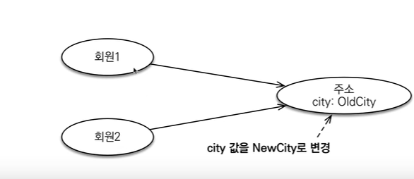
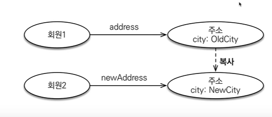
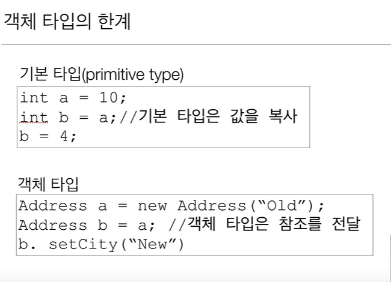
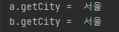

# 값 타입과 불변 객체

`값 타입은 복잡한 객체 세상을 조금이라도 단순화하려고 만든 개념이다. 따라서 값 타입은
단순하고 안전하게 다룰 수 있어야 한다.`

## 값 타입 공유 참조

- 임베디드 타입 같은 값 타입을 여러 엔티티에서 공유하면 위험하다.
- 부작용(side effect) 발생




```java
  Address address = new Address("서울", "1111" ,"청담 1동");

            Member member = new Member();
            member.setUsername("박코니");
            member.setHomeAddress(address);
            em.persist(member);

            Member member2 = new Member();
            member2.setUsername("장정운");
            member2.setHomeAddress(address);
            em.persist(member2);

            member2.getHomeAddress().setCity("양산");
            // member2에 있는 주소만 바꾸고 싶다.
```

나는 분명히 member2의 주소만 양산으로 변경하고싶었는데,

실제로는 update 쿼리가 두번 나가면서 member1의 주소까지 함께 변경되었다.

### 값 타입 복사

- 값 타입의 실제 인스턴스인 값을 공유하는 것은 위험
- 대신 값(인스턴스)을 복사해서 사용




```java
  Address address = new Address("서울", "1111" ,"청담 1동");

            Member member = new Member();
            member.setUsername("박코니");
            member.setHomeAddress(address);
            em.persist(member);

            Address copyAddress = new Address(address.getCity(), address.getZipcode(), address.getStreet());

            Member member2 = new Member();
            member2.setUsername("장정운");
            member2.setHomeAddress(copyAddress);
            em.persist(member2);

            member.getHomeAddress().setCity("부산");
            // member2에 있는 주소만 바꾸고 싶다.

           tx.commit();
```

인스턴스를 복사해서 사용하였다.

### 객체 타입의 한계

- 항상 값을 복사해서 사용하면 공유 참조로 인해 발생하는 부작용을 피할 수 있다.
- 문제는 임베디드 타입처럼 직접 정의한 값 타입은 자바의 기본 타입이 아니라 객체 타입이다.
- 자바 기본 타입에 값을 대입하면 값을 복사한다.
- 객체 타입은 참조 값을 직접 대입하는 것을 막을 방법이 없다.
- 객체의 공유 참조는 피할 수 없다.





```java
 Address a = new Address("부산");
        Address b = a;

        b.setCity("서울");

        System.out.println("a.getCity =  "  + a.getCity());
        System.out.println("b.getCity =  " +b.getCity());

```

객체 타입은 참조를 복사하기 때문에 

결과는 !!



### 불변 객체

- 객체 타입을 수정할 수 없게 만들면 부작용을 원천 차단
- 값 타입은 불변 객체(immutable object)로 설계해야함
- 불변 객체 : 생성 시점 이후 절대 값을 변경할 수 없는 객체
- 생성자로만 값을 설정하고 수정자(Setter)를 만들지 않으면 됨
- 참고 : Integer, String 은 자바가 제공하는 대표적인 불변 객체


※ 즉 !!
setter를 쓰지 않고 바꿔야한다.

이렇게!!

```java
   Address address = new Address("서울", "1111" ,"청담 1동");

            Member member = new Member();
            member.setUsername("박코니");
            member.setHomeAddress(address);
            em.persist(member);

            Address newAddress = new Address("뉴욕", address.getZipcode(), address.getStreet());

            member.setHomeAddress(newAddress);

```


`불변이라는 작은 제약으로 큰 부작용을 막을 수 있다.`