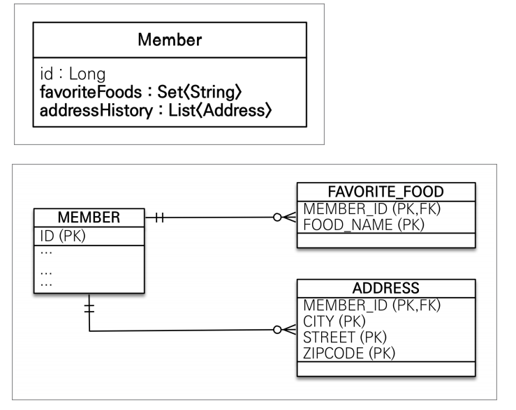

# 값타입 컬렉션

- 값 타입을 하나 이상 저장할 때 사용
- @ElementCollection, @CollectionTable 사용
- 데이터베이스는 컬렉션을 같은 테이블에 저장할 수 없다.
- 컬렉션을 저장하기 위한 별도의 테이블이 필요함



```java
@Entity
public class Member {

    @Id
    @GeneratedValue
    @Column(name = "MEMBER_ID")
    private Long id;

    @Column(name = "USERNAME")
    private String username;

    @ManyToOne(fetch = FetchType.LAZY)
    @JoinColumn(name = "team_id")
    private Team team;

    @Embedded
    private Period period;

    @Embedded
    private Address homeAddress;

    @ElementCollection
    @CollectionTable(name = "FAVORITE_FOOD", joinColumns =
    @JoinColumn(name = "MEMBER_ID")
    )
    @Column(name = "FOOD_NAME")
    private Set<String> favoriteFoods = new HashSet<>();

    @ElementCollection
    @CollectionTable(name = "ADDRESS", joinColumns = @JoinColumn(name =
            "MEMBER_ID"))
    private List<Address> addressHistory = new ArrayList<>();
}


```


```java
    Member mm = new Member();
            mm.setUsername("거니");
            mm.setHomeAddress(new Address("부산","1111","대성래미안"));
            mm.getFavoriteFoods().add("치킨");
            mm.getFavoriteFoods().add("삼겹살");
            mm.getFavoriteFoods().add("피자");
            mm.getAddressHistory().add(new Address("서울","1111","청담동"));
            mm.getAddressHistory().add(new Address("부산 신평","1111","한신 아파트"));

            em.persist(mm);

            em.flush();
            em.clear();

            System.out.println("================= START ============");
            Member findMember = em.find(Member.class, mm.getId());

            // 부산 -> 서울
//            findMember.getHomeAddress().setCity("서울");

            Address a = findMember.getHomeAddress();
            findMember.setHomeAddress(new Address("서울",a.getZipcode(),a.getStreet()));

            //치킨 ->한식
            findMember.getFavoriteFoods().remove("치킨");
            findMember.getFavoriteFoods().add("한식");

            findMember.getAddressHistory().remove(new Address("부산 신평","1111","한신 아파트"));
            findMember.getAddressHistory().add(new Address("신평","1111","한신 아파트"));


        tx.commit();
```

## 값 타입 컬렉션의 제약사항

- 값 타입은 엔티티와 다르게 식별자 개념이 없다.
- 값은 변경하면 추적이 어렵다.
- 값 타입 컬렉션에 변경 사항이 발생하면, 주인 엔티티와 연관된
모든 데이터를 삭제하고, 값 타입 컬렉션에 있는 현재 값을 모두 다시 저장한다.
- 값 타입 컬렉션을 매핑하는 테이블은 모든 컬럼을 묶어서 기본 키를 구성해야함
: null 입력x ,  중복 저장 x
  
## 값 타입 컬렉션 대안

- 실무에서는 상황에 따라 값 타입 컬렉션 대신에 일대다 관계를 고려
- 일대다 관계를 위한 엔티티를 만들고, 여기에서 값 타입을 사용
- 영속성 전이(Cascade) + 고아 객체 제거를 사용해서 값 타입 컬렉션 처럼 사용
- EX) AddressEntity


## 정리 
- 엔티티 타입의 특징
  - 식별자가 있다.
  - 생명 주기 관리
  - 공유
    
- 값 타입의 특징
    - 식별자가 없다.
    - 생명 주기를 엔티티에 의존
    - 공유하지 않는 것이 안전(복사해서 사용)
    - 불변 객체로 만드는 것이 안전
