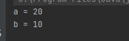

# JPA의 데이터 타입 분류
*********
- ## 엔티티타입
  - @Entity로 정의하는 객체
  - 데이터가 변해도 식별자로 지속해서 추적 가능
  - 예) 회원 엔티티의 키나 나이 값을 변경해도 식별자로 인식 가능
    

- ## 값 타입
    - int , integer, String 처럼 단순히 값으로 사용하는 자바 기본 타입이나 객체
    - 식별자가 없고 값만 있으므로 변경 시 추적 불가
    - 예) 숫자 100을 200으로 변경하면 완전히 다른 값으로 대체
    
******
### 값 타입 분류

- 기본값 타입
    - 자바 기본 타입(int , double)
    - 래퍼 클래스(Integer , Long)
    - String
    
- 임베디드 타입(embedded type , 복합 값 타입)
- 컬렉션 값 타입(collection value type)

********

#### 기본값 타입

- 예) String name , int age
- 생명주기를 엔티티에 의존
    - 예) 회원을 삭제하면 이름, 나이 필드도 함께 삭제
    
- 값 타입은 공유하면 안된다
    - 예) 회원 이름 변경시 다른 회원의 이름도 함께 변경되면 안된다.
    
*************

### 참고 : 자바의 기본 타입은 절대 공유 되지 않는다.

```java

    public static void main(String[] args) {
        int a = 10;
        int b = a;

        a = 20;

        System.out.println("a = " +a);
        System.out.println("b = " +b);
    }
```



기본 값은 절대 공유 되지 않기 때문에 

(즉, b에 a를 대입한 뒤 a 값을 바뀌어도 둘은 다른 레퍼런스&주소 값이기 때문에 b는 변경되지 않는다.)


- int , double 같은 기본타입(primitive type)은 절대 공유 되지 않는다.
- 기본 타입은 항상 값을 복사한다.
- Integer같은 래퍼 클래스나 String 같은 특수한 클래스는 공유 가능한 객체이지만 변경 X


`반면`

```java
        Integer a = new Integer(10);
        Integer b = a;

        a.setValue(20);

        System.out.println("a = " +a);
        System.out.println("b = " +b);
```

Integer는 래퍼 클래스로 공유 가능하다.

즉, a와 b는 같은 레퍼런스 & 주소를 같고 있지만

변경이 불가하다. 위의 코드의 setValue는 없다 

그래서 실제로 변경할 방법이 없다.

하지만 만약 setValue의 기능으로 a의 값이 변경되면 

같은 레퍼런스인 b의 값도 함께 변경된다. (둘이 공유 하기 때문)