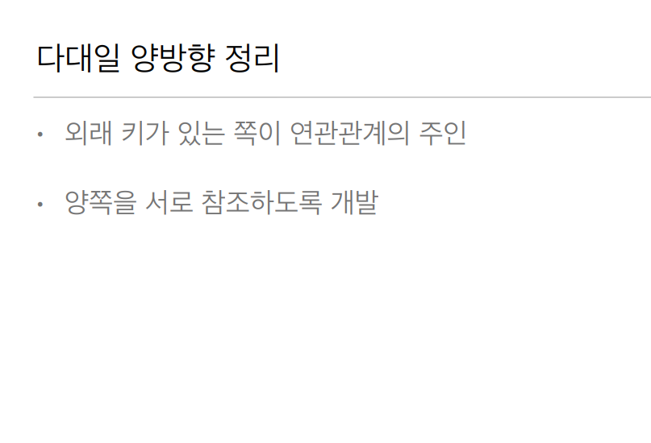

# 다대일[N:1]

### 다대일 단방향


`Member.java`

```java
@Entity
public class Member {

    @Id @GeneratedValue
    @Column(name = "MEMBER_ID")
    private Long id;

    @Column(name = "USERNAME")
    private String username;

    @ManyToOne
    @JoinColumn(name = "TEAM_ID")
    private Team team;

    public Long getId() {
        return id;
    }

    public void setId(Long id) {
        this.id = id;
    }

    public String getUsername() {
        return username;
    }

    public void setUsername(String username) {
        this.username = username;
    }

    @Override
    public String toString() {
        return "Member =" +
                "id=" + id +
                ", username='" + username;
    }
}

```

`Team.java`
```java
@Entity
public class Team {

    @Id @GeneratedValue
    @Column(name = "TEAM_ID")
    private Long id;
    private String name;
    
    public Long getId() {
        return id;
    }

    public void setId(Long id) {
        this.id = id;
    }

    public String getName() {
        return name;
    }

    public void setName(String name) {
        this.name = name;
    }
}

```

Team 엔티티에서는 Member를 참조 하지않는다.

### 다대일 양방향


Team 엔티티에서도 member를 참조 하고 싶으면

그냥 member 객체를 넣으면 된다. 그렇게 해도 테이블에는 아무 영향이 없다.

`Member.java`
```java
@Entity
public class Member {

    @Id @GeneratedValue
    @Column(name = "MEMBER_ID")
    private Long id;

    @Column(name = "USERNAME")
    private String username;

    @ManyToOne
    @JoinColumn(name = "TEAM_ID")
    private Team team;

    public Long getId() {
        return id;
    }

    public void setId(Long id) {
        this.id = id;
    }

    public String getUsername() {
        return username;
    }

    public void setUsername(String username) {
        this.username = username;
    }

    @Override
    public String toString() {
        return "Member =" +
                "id=" + id +
                ", username='" + username;
    }
}


```

`Team.java`
```java
@Entity
public class Team {

    @Id @GeneratedValue
    @Column(name = "TEAM_ID")
    private Long id;
    private String name;
    
    @OneToMany(mappedBy = "team")
    private List<Member> members = new ArrayList<>();

    public Long getId() {
        return id;
    }

    public void setId(Long id) {
        this.id = id;
    }

    public String getName() {
        return name;
    }

    public void setName(String name) {
        this.name = name;
    }
}
```

