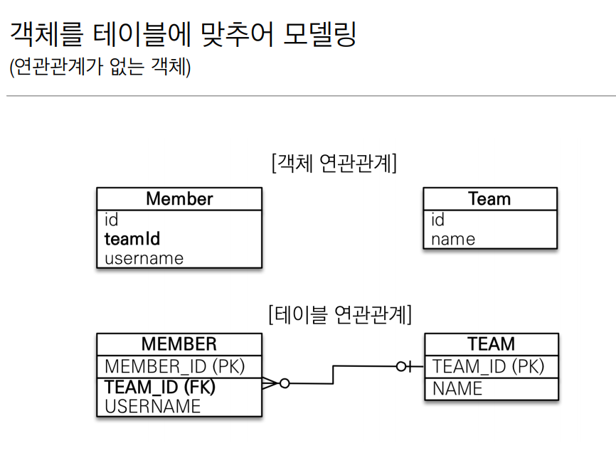
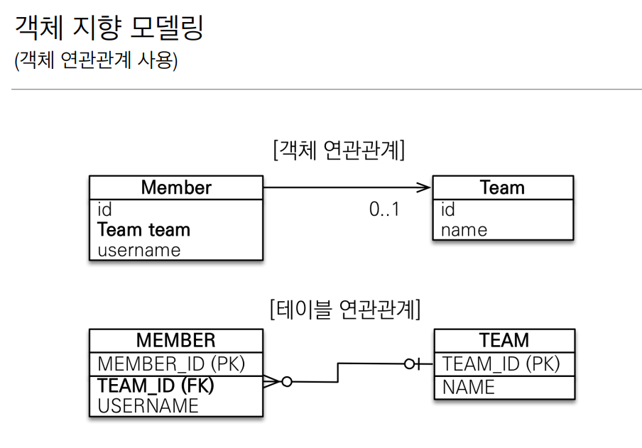
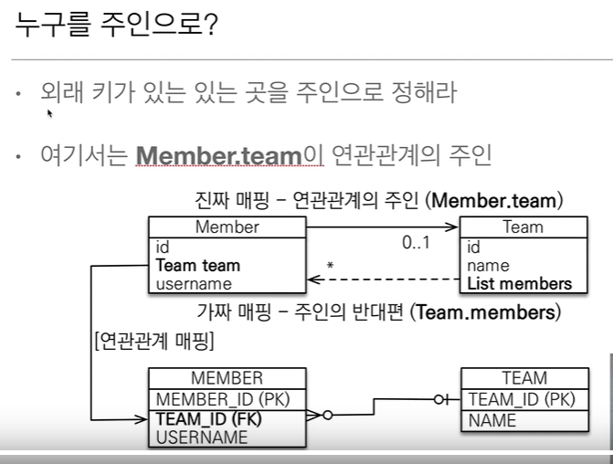

# 연관관계가 필요한 이유



`Member.java`

```java
@Entity
public class Member {

    @Id @GeneratedValue
    @Column(name = "MEMBER_ID")
    private Long id;

    @Column(name = "USERNAME")
    private String username;

    @Column(name = "TEAM_ID")
    private Long teamId;


    public Long getId() {
        return id;
    }

    public void setId(Long id) {
        this.id = id;
    }

    public String getUsername() {
        return username;
    }

    public void setUsername(String username) {
        this.username = username;
    }

    public Long getTeamId() {
        return teamId;
    }

    public void setTeamId(Long teamId) {
        this.teamId = teamId;
    }
}
```

`Team.java`
```java
@Entity
public class Team {

    @Id @GeneratedValue
    @Column(name = "TEAM_ID")
    private Long id;

    private String name;

    public Long getId() {
        return id;
    }

    public void setId(Long id) {
        this.id = id;
    }

    public String getName() {
        return name;
    }

    public void setName(String name) {
        this.name = name;
    }
}

```

`JpaMain.java`

```java
  try{
          Team realmadrid = new Team();
          realmadrid.setName("레알마드리드");
          em.persist(realmadrid);
          Member ramos = new Member();
          ramos.setUsername("라모스");
          ramos.setTeamId(realmadrid.getId());

          em.persist(ramos);


          tx.commit();


        }catch (Exception e){
          tx.rollback();
        }finally {
          em.close();
        }
      emf.close();
    }
```

member.setTeamId 를 통해 외래키를 직접 다루면서

뭔가 객체지향스럽지 못하다, (member.setTeam이 객체지향 스럽다)

또, 연관관계를 사용하지 않으면

어떤 멤버의 팀 정보를 알고 싶으면 멤버의 값을 꺼내고

그 팀은 꺼낸 멤버의 pk값을 통해 불러와야 한다.

```java
Member ramos = em.find(Member.class , 2L);

Long findTeamId = ramos.getTeamId();

Team real = em.find(Team.class, findTeamId);
```


연관관계를 사용했으면 멤버의 값을 꺼내자마자 팀의 정보를 알 수 있다.

### **중요** ! - 이해하기!


# 객체 연관관계 사용하기



