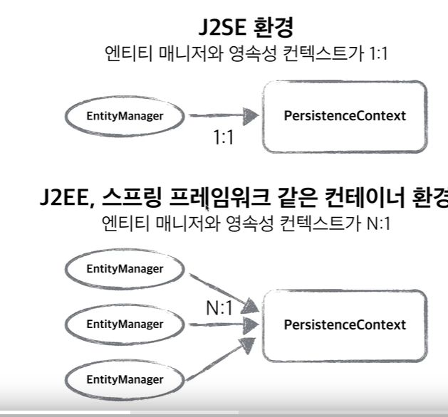
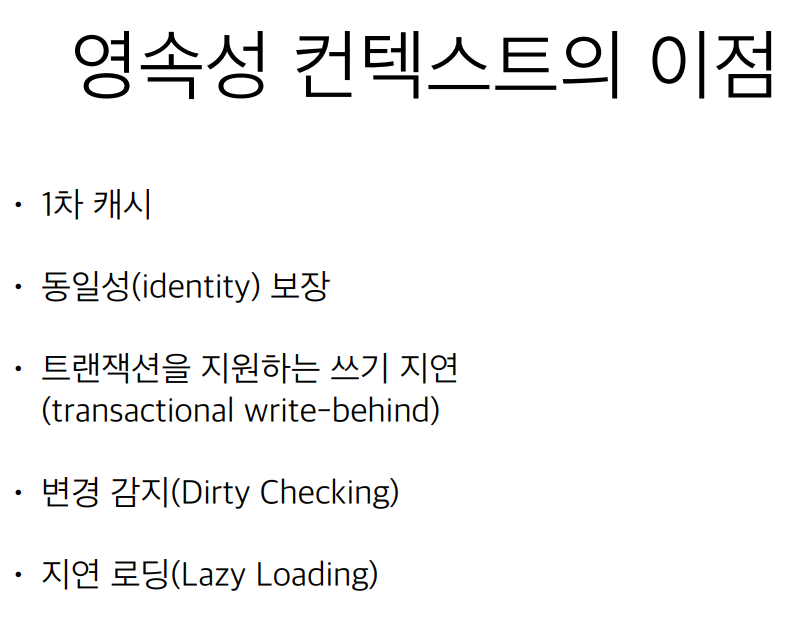

# 영속성 컨텍스트

- JPA를 이해하는데 가장 중요한 용어
- "엔티티를 영구 저장하는 환경" 이라는 뜻
- EntityManager.persist(entity);

=> DB에 저장하는 것이 아니라 영속성 컨텍스트에 저장하는 것이다

## 엔티티 매니저 & 영속성 컨텍스트
- 영속성 컨텍스트는 논리적인 개념
- 눈에 보이지 않는다.
- 엔티티 매니저를 통해서 영속성 컨텍스트에 접근



엔티티 매니저안에 영속성 컨텍스트가 있다 (눈에 보이지 않을 뿐이다)

# 엔티티의 생명주기
- `비영속(new/transient)`

영속성 컨텍스트와 전혀 관계가 없는 새로운 상태
- `영속(managed`

영속성 컨텍스트에 관리 되는 상태
- `준영속(detached)`

영속성 컨텍스트에 저장되었다가 분리된 상태
-  `삭제(removed)`

삭제된 상태


`JpaMain.java`

```java
try {

            //비영속
            Member member = new Member();
            member.setUsername("박건희");

            // 영속
            System.out.println("===== BEFORE ======");
            em.persist(member);
            System.out.println("======= AFTER =======");

            tx.commit();


        } catch (Exception e) {
            tx.rollback();
        } finally {
            em.close();
        }
        emf.close();
```
before와 after 사이에는 insert 쿼리가 날라가지 않는다.

그 뒤에 insert 쿼리가 날라간다

즉 영속상태라고 해서 바로 DB에 쿼리가 날라가는 것이 아니라 commit을 해야한다.

