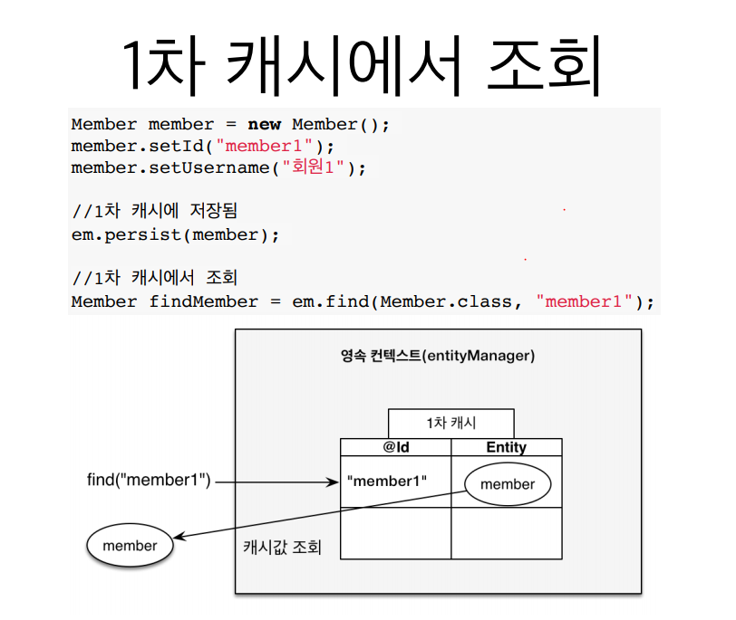
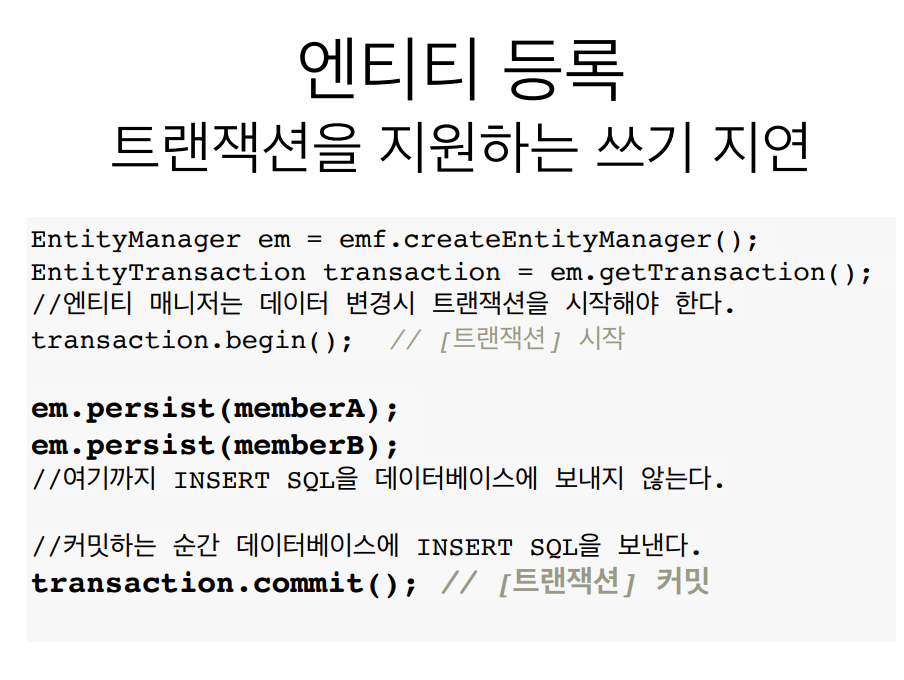
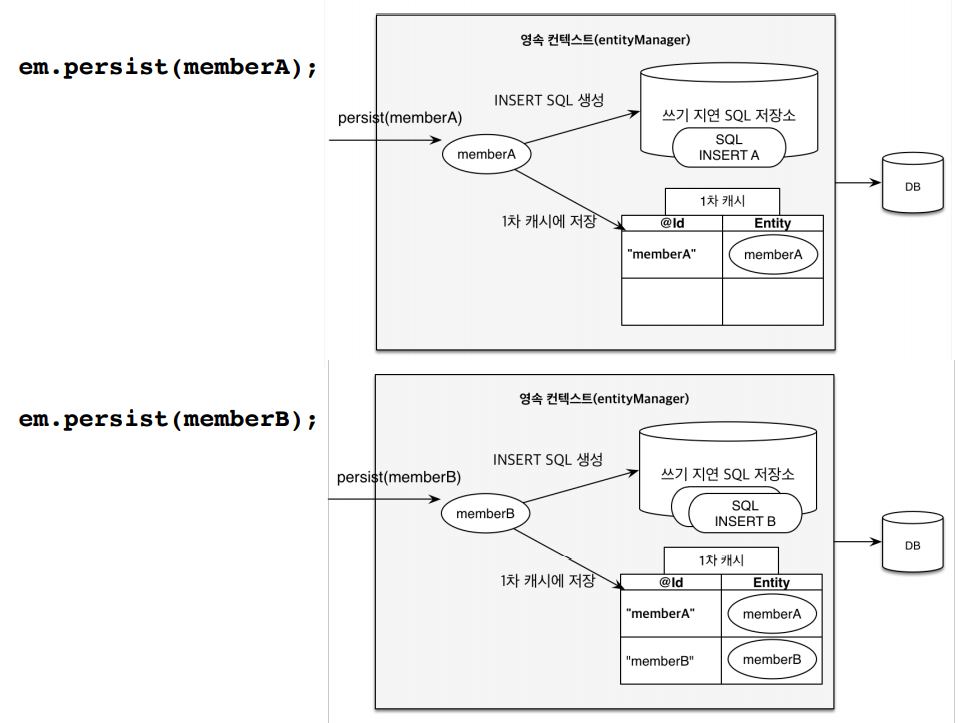

# 영속성 컨텍스트2



`JpaMain.java`

```java
  try {

            //비영속
            Member member = new Member();
            member.setUsername("박건희");

            // 영속
            System.out.println("===== BEFORE ======");
            em.persist(member);
            System.out.println("======= AFTER =======");

            Member findMember = em.find(Member.class, 1L);

            System.out.println("findMember.id = " +findMember.getId()) ;
            System.out.println("findMember.name = " +findMember.getUsername());

            tx.commit();


        } catch (Exception e) {
            tx.rollback();
        } finally {
            em.close();
        }
        emf.close();
    }
```

findMember.getId & findMemnber.getUsername을 조회하는데

콘솔에서 보면

select 쿼리가 나가지 않는다.

왜냐하면 DB에서 조회하는 것이 아니라 1차 캐시에서 조회하기 때문이다.





`JpaMain.java`

```java

        try {

           //영속
            Team team = new Team("뮌헨");


            Member m1 = new Member("레반도프스키 ",team );
            Member m2 = new Member("로벤" ,team);

            em.persist(team);
            em.persist(m1);
            em.persist(m2);

            System.out.println("=====================================");

            tx.commit();


        } catch (Exception e) {
            tx.rollback();
        } finally {
            em.close();
        }
        emf.close();
    }
```


=============== 이후에 insert 쿼리가 나간다.


### 더티체킹

```java
   Team findTeam = em.find(Team.class , 1L);

            findTeam.setName("바이에른 뮌헨");


            System.out.println("=====================================");

            tx.commit();

```

*******
아이디가 1인 team의 객체를 꺼낸뒤

이름읇 변경한 뒤에  `em.persist` 를 할 필요가 없다,

java collection 에서 값을 까낸 뒤 변경하고 나서 다시 집어 넣지 않듯이

JPA도 마찬가지다.

값만 변경하고 그냥 commit 하면 update 문이 알아서 나간다.

이것이 더티 체킹이다.