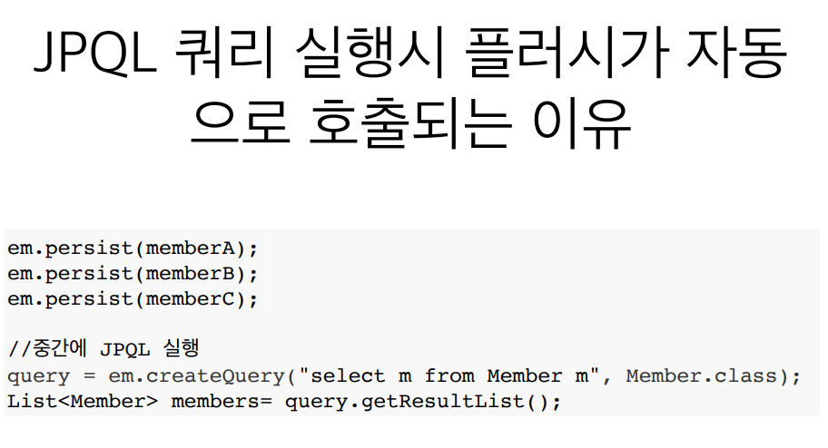

# 플러시

영속성 컨텍스트의 변경내용을 데이터베이스에 반영

## 플러시가 발생하면?

- 변경감지
- 수정된 엔티티 쓰기 지연 SQL 저장소에 등록
- 쓰기 지연 SQL 저장소의 쿼리를 데이터베이스에 전송
 
  (등록, 수정 ,삭제 쿼리)

## 영속성 컨텍스트를 플러시 하는 방법
- em.flush() - 직접 호출
- 트랜잭션 커밋 - 플러시 자동 호출
- JPQL 쿼리 실행 - 플러시 자동 호출


```java

           Team team = new Team("맨시티");
           em.persist(team);
           Member member = new Member();
           member.setTeam(team);
           em.persist(member);


           em.flush();

            System.out.println("=====================================");

            tx.commit();

```

flush를 직접 바로 호출했기 때문에 이번 에는 ============

이전에 insert 쿼리가 날아가서 DB에 반영된다.

** 참고 **

flush를 한다고 해서 1차 캐시가 지워지는 것이 아니라

오직 영속성컨텍스트에 있는 쓰기 지연 SQL 저장소가 DB에 반영 되는 것 뿐이다.




## 플러시는!!

- 영속성 컨텍스트를 비우지 않는다.
- 영속성 컨텍스트의 변경내용을 데이터베이스에 동기화
- 트랜잭션이라는 작업 단위가 중요 -> 커밋 직전에만 동기화 하면 된다.
