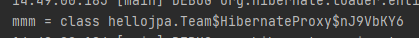

# 즉시로딩과 지연로딩

`Member.java`

```java
    @ManyToOne(fetch = FetchType.LAZY)
    @JoinColumn(name = "TEAM_ID")
    private Team team;
```

지연로딩 설정

```java
 Team team = new Team("AC밀란");

            em.persist(team);
            Member member = new Member("즐라탄");
            member.setTeam(team);

            em.persist(member);

            em.flush();
            em.clear();

            Member mmm = em.find(Member.class , member.getId());

            System.out.println("mmm = " +mmm.getTeam().getClass());

            tx.commit();

```

Member를 조회할 때 이제는 select member만 조회한다.

그리고 Team의 클래스 타입을 보면 진짜가 아니고 프록시 타입이다.


## Member와 Team을 자주 함께 사용한다면?


즉시로딩 사용

```java
    @ManyToOne(fetch = FetchType.EAGER)
    @JoinColumn(name = "TEAM_ID")
    private Team team;
```

쿼리에서 Join으로 한 방에 다 가져온다.

팀의 클래스 타입을 보면 진짜가 나타났다


원래는 select를 두번 해서 member 정보와 team 정보를 가져왔다.

##  프록시와 즉시로딩 주의

- 가급적 지연 로딩만 사용(특히 실무에서)
- 즉시 로딩을 적용하면 예상하지 못한 SQL이 발생
- 즉시 로딩은 JPQL에서 N+1 문제를 일으킨다.
- @ManyToOne, @OneToOne은 기본이 즉시 로딩

-> LAZY로 설정

- @OneToMany , @ManyToMany는 기본이 지연 로딩